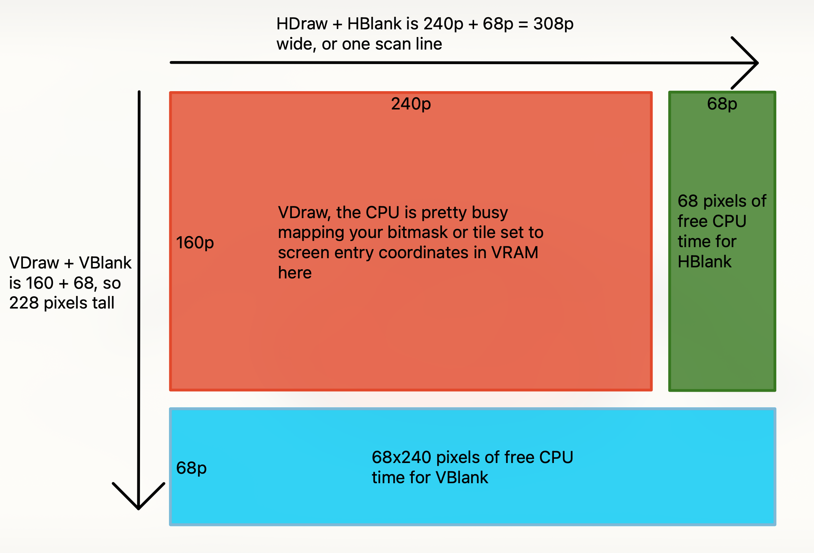

*Note:* This isn't done, nor will it probably ever really be *done*. I'll add to it when I want, but enjoy if you stumble across it while it's a bit half-baked.

Table of Contents
* [Setting up a development environment](#section1)
* [GRIT & Aseprite pixel art workflow](#section2)
* [VDraw, VBlank, HDraw, and HBlank](#section3)
* [A quick note on hexadecimal notation](#section4)
* [Fixed point notation](#section5)

<h1 id={'section1'}>Setting up a development environment</h1>

Standing up a development env for building GBA ROMs isn't the most straight forward task ever, but it's also not
super complicated. It took me about 6 hours to go from nothing, to an entire build pipeline that launches my compiled
ROM in mGBA by pressing _f5_. Debugging with _ctrl + f5_ took another couple of hours to figure out.

I stood up my environment in Windows 11 with Windows Subsystem for Linux (WSL).

I've already documented these steps in a [README](https://github.com/abullard/gba_study/blob/main/documentation/README.md)
on my _gba_study_ repo. Hopefully these help you get situated!

---
<h1 id={'section2'}> GRIT & Aseprite pixel art workflow</h1>

GBA Raster Image Transmogrifier ([GRIT](https://www.coranac.com/man/grit/html/grit.htm#sec-intro)) is a Command Line
Interface (CLI) tool to convert `png/jpeg/bmp/etc` files into various data formats to load into your ROM.

My use case is as follows:
1. Use [Aseprite](https://www.aseprite.org/), a modern pixel art editor, to make art
    - Build sprites at various tile sizes (1 tile is 8x8 pixels = 1t is 8x8p)
        - ignore the binary headers for now. You'll eventually load these masks into Video RAM (`VRAM`) to tell the GBA how to render

| shape\size | 00 | 01 | 10 | 11 |
|---|---|---|---|---|
| 00 | 8x8p | 16x16p | 32x32p | 64x64p |
| 01 | 16x8p | 32x8p | 32x16p | 64x32p |
| 10 | 8x16p | 8x32p | 16x32p | 32x64p |

 - Build backgrounds at various tile sizes with up to 5 layers.
    - 128x128p (32x32t) to 1024x1024p (128x128t)
    - The GBA supports up to 4 background layers, and 1 sprite layer.
2. Export my background layers and sprites to one of these file types: `png/jpeg/bmp`
3. Drop the exports into a hierarchical folder structure that separates over-world levels from individual rooms.
4. Pre-process my exported art via GRIT during execution of `make`, converting the image files to binary and storing
them in `libgfx.a`.
    - GRIT is really flexible, you can specify an `<imageName>.grit` file to compile 1 specific file for `libgfx.a`or
   you can specify a directory level `.grit` file to compile multiple images in with one set of CLI options.
    - Here are my
   [example grit files](https://github.com/abullard/gba_study/blob/main/filbert/libgfx/maps/lvl1/bedroom/lvl1_bg1_bedroom.grit).
Pay close attention to the folder structure I've created. `libgfx/obj` is used to store sprites and their respective
   `.grit` files. There are comments explaining all options I used.
5. Link `libgfx.a` to my compiled ROM and import the arrays of binary data into which C file needs them so I can
`memcpy` them into some registers within the 96KB of `VRAM`
    - 1 array is for the tile sets
    - 1 array is for the color palette at various bit depths
    - 1 array is for the screen entry coords
    - woah, lots of complexity stacked into this list, spend some time on [Tonc](https://coranac.com/tonc/text/toc.htm)
for more detailed info

TODO

---
<h1 id={'section3'}>VDraw, VBlank, HDraw, and HBlank</h1>
There's no physics clock on the GBA.

So engines like Unity or Godot using a hardware clock wrapper like `time.deltaTime()`, won't work for us.

Instead, we have to rely on timing our physics and animation updates via the _refresh rate of the screen_. NTSC games
average about 60fps, depending on the efficiency of your code, and which mode your ROM puts the GBA into. (Bitmasks via
mode 1 tend to run a lot slower, about 30fps).

This point is extremely important! __Why?__

Because one screen refresh is equal to 240 pixels drawn across the screen by 160 scan lines. A scan line is one row of
240 pixels. It's a bit more involved than this, but we get a couple of benefits from the display drawing via scan lines.

There are two buffers of "pixels" that sit just past the 240 horizontal pixels, and 160 vertical pixels. Both buffers
are 68 pixels large. Let's visualize this and then get to the benefits.



Benefits:
1. After each HDraw phase we enter HBlank. Any hardware interrupts requested during HDraw are handled during HBlank.
    - Requesting a hardware interrupt is accomplished via the BIOS of the GBA, and a typeless, void function pointer,
   but that's out of the scope of this blog.
    - An interrupt is a way to tell the GBA, "HEY! Halt what you're doing and instead do this other thing I need."
    - The most common interrupt during HBlank is to `memcpy` data to `VRAM`. This is often used to load new maps or
   sprites to be drawn on screen.
2. The CPU is completely free to run whatever code you write during HBlank and VBlank. As long as you don't clutter your
thread with a bunch of processing. A brand-new ROM has nothing to handle during VBlank. A fleshed out game has a lot to
handle during VBlank.
    - During VBlank, we compound the time from both the remaining 68 scan lines and HBlank, giving us even more CPU
time.
    - Hardware interrupts are also handled here.
    - Most often, VBlank is used to check user input, calculate physics
3. Let's do some monster math.
    - `A`: 1 cpu clock cycle takes `59.6 nanoseconds`
    - `B`: a screen refresh takes `280,896` cpu clock cycles
    - `C`: `A + B` shows us that `280,896 * 59.6ns = 16.74 million ns`
    - `D`: Convert `C` to microseconds: `16.74 million ns / 1000μs = 16,741.4μs`
    - `E`: Convert `D` to milliseconds: `16,741.4μs / 1000ms = 16.74ms`
    - and finally, `F`: `60fps * 16.74ms = 1000ms = 1 second`

1 screen refresh takes 16.74 milliseconds. 60 screen refreshes takes 1004 milliseconds.
Or...wait...1 second?? Woah! We have something comparable to `time.deltaTime()`!

Now you can skip time, _t_, in your project motion equation and just rely on execution of your function happening 60
times a second. It just so happens that this'll occur during VBlank, which happens after each screen refresh (:

---
<h1 id={'section4'}>A quick note on hexadecimal notation</h1>

`0x04AE` expands into `0000 0100 1010 1110`. An explanation with a table:

| Hex (base 16) | Binary (base 2) | Decimal (base 10) |
|--|--|--|
| 0 | 0000 | 0 |
| 1 | 0001 | 1 |
| 2 | 0010 | 2 |
| 3 | 0011 | 3 |
| 4 | 0100 | 4 |
| 5 | 0101 | 5 |
| 6 | 0110 | 6 |
| 7 | 0111 | 7 |
| 8 | 1000 | 8 |
| 9 | 1001 | 9 |
| A | 1010 | 10 |
| B | 1011 | 11 |
| C | 1100 | 12 |
| D | 1101 | 13 |
| E | 1110 | 14 |
| F | 1111 | 15 |

When we talk about loading bit masks to registers on hardware, we often write in shorthand similar to `0x04AE`.
After some practice, this allows us to more quickly understand things like setting the 16-bit display control register:

``` C withLineNumbers
#define DISPLAY_CONTROL_SPRITE_1D 0x0040 // sprite VRAM indexed as an array
#define DISPLAY_CONTROL_SPRITE 0x1000 // Enable sprites
#define DISPLAY_CONTROL_BACKGROUND3 0x0800 // Enable bg 3
#define DISPLAY_CONTROL_BACKGROUND2 0x0400 // Enable bg 2
#define DISPLAY_CONTROL_BACKGROUND1 0x0200 // Enable bg 1

REGISTER_DISPLAY_CONTROL = DISPLAY_CONTROL_SPRITE_1D |
    DISPLAY_CONTROL_SPRITE |
    DISPLAY_CONTROL_BACKGROUND3 |
    DISPLAY_CONTROL_BACKGROUND2 |
    DISPLAY_CONTROL_BACKGROUND1;
```

After execution of the bitwise OR ops in the above code block, `REGISTER_DISPLAY_CONTROL` is holds this bitmask:
`0001 1110 0100 0000`. The hardware will read these registers and display the screen accordingly.

Spend some time understanding this hexadecimal format and the bitwise OR operator starting on line 7.

---
<h1 id={'section5'}>Fixed point notation</h1>

What if I told you that `10101100 = 10.75` in binary? This isn't an accurate statement, of course. But we can _pretend_ it
is for arithmetic purposes.

This is definitely my favorite part of the GBA to explain. Not because I think I'm good at it, but telling people

> "The GBA can't handle arithmetic with fractional values, unless you fake it with binary"

is an absolute blast. Let's get into it.

`1010` (base 2), is A (base 16) or 10 (base 10), we established this in the "quick note on hexadecimal notation" section. Let's look at how we get
10, in binary:

`(2^3 * 1) + (2^2 * 0) + (2^1 * 1) + (2^0 * 0)`

= `(8 * 1) + (4 * 0) + (2 * 1) + (1 * 0)`

= `8 + 0 + 2 + 0`

= `10`.

The exponents are positional, with a 0 index starting from the right. 2 raised to its 0 indexed position multiplied by
its ON or OFF value, 1 or 0 respectively.

We _chose_ to march one number to the left with each position...What if we march right?

`1010 1100`. Let's ignore the Left hand side of this binary. That leaves us with `1100`. Move right one number at
a time, and subtract your positional data, making sure to drop your negative exponents to the denominator position:

`(2^-1 * 1) + (2^-2 * 1) + (2^-3 * 0) + (2^-4 * 0)` =

`(1/(2^1) * 1) + (1/(2^2) * 1) + (1/(2^3) * 0) + (1/(2^4) * 0)` =

`1/2 + 1/4 + 0 + 0` =

`0.5 + 0.25`=

`0.75`

Tying all this together, we see that `10101100` is 10.75 in 4.4f Fixed point notation. 8.8f FPN would be a binary number
like `00000001|10000000`. I added a bar to separate the integers from the floats, and took the liberty of making this
example brain-dead. It's 1.5 in base 10.

I won't go through all the math, but we can use 1's and 2's compliment and various other bitwise operators to handle
arithmetic on these fixed point notation binary strings. When we're done with our base 2 math, we'll have a binary number
that represents an _approximate_ floating point value.

Voilà, you can now represent gravity at `-9.875` or a signed 16-bit integer that holds `1000 1001 1110 0000`. More bits
means more precision, but also more cognitive load.
