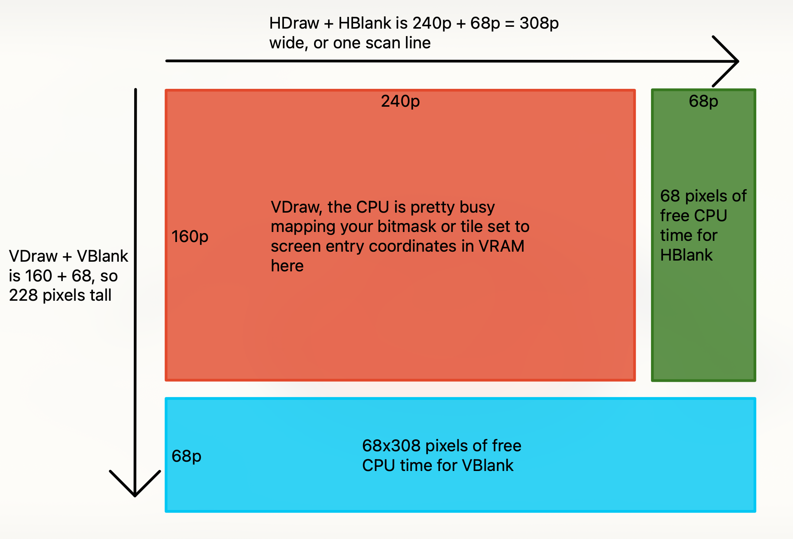

### Setting up a development environment

Standing up a development env for building GBA ROMs isn't the most straight forward task ever, but it's also not
super complicated. It took me about 6 hours to go from nothing, to an entire build pipeline that launches my compiled
ROM in mGBA by pressing _f5_. Debugging with _ctrl + f5_ took another couple of hours to figure out.

I stood up my environment in Windows 11 with Windows Subsystem for Linux (WSL).

I've already documented these steps in a [README](https://github.com/abullard/gba_study/blob/main/documentation/README.md)
on my _gba_study_ repo. Hopefully these help you get situated!

---
### GRIT & Aseprite pixel art workflow

Gameboy Raster Image Transmogrifier ([GRIT](https://www.coranac.com/man/grit/html/grit.htm#sec-intro)) is a Command Line
Interface (CLI) tool to convert `png/jpeg/bmp/etc` files into various data formats to load into your ROM.

My use case is as follows:
1. Use [Aseprite](https://www.aseprite.org/), a modern pixel art editor, to make art
    - Build sprites at various tile sizes (1 tile is 8x8 pixels = 1t is 8x8p)
        - ignore the binary headers for now. You'll eventually load these masks into `VRAM` to tell the GBA how to render

| shape\size | 00 | 01 | 10 | 11 |
|---|---|---|---|---|
| 00 | 8x8p | 16x16p | 32x32p | 64x64p |
| 01 | 16x8p | 32x8p | 32x16p | 64x32p |
| 10 | 8x16p | 8x32p | 16x32p | 32x64p |

 - Build backgrounds at various tile sizes with up to 5 layers.
    - 128x128p (32x32t) to 1024x1024p (128x128t)
    - The GBA supports up to 4 background layers, and 1 sprite layer.
2. Export my background layers and sprites to one of these file types: `png/jpeg/bmp`
3. Drop the exports into a hierarchical folder structure that separates levels from rooms
4. Pre-process my exported art via GRIT during execution of `make`, converting the image files to binary and storing
them in `libgfx.a`
    - GRIT is really flexible, you can specify an `<imageName>.grit` file to compile 1 specific file for `libgfx.a`or
   you can specify a directory level `.grit` file to compile multiple images in with one set of CLI options.
    - Here are my
   [example grit files](https://github.com/abullard/gba_study/blob/main/filbert/libgfx/maps/lvl1/bedroom/lvl1_bg1_bedroom.grit).
Pay close attention to the folder structure I've created. `libgfx/obj` is used to store sprites and their respective
   `.grit` files.
5. Link `libgfx.a` to my compiled ROM and import the arrays of binary data into which C file needs them so I can
`memcpy` them into some registers within the 96KB of `VRAM`
 - woah, lots of complexity stacked into this sentence, spend some time on [Tonc](https://coranac.com/tonc/text/toc.htm)
for more detailed info

---
### VDraw, VBlank, and HBlank
Hopefully this'll be an easy concept to digest.

There's no clock on the GBA. So engines like Unity or Godot using a clock interface like `time.deltaTime()`, won't
work for us.

Instead, we have to rely on timing our physics and animation updates via the _refresh rate of the screen_. NTSC games average about 60fps,
depending on the efficiency of your code, and which mode your ROM puts the GBA into.

This bit of information is important! __Why?__

Because one screen refresh is equal to 240 pixels drawn across the screen by 160 scan lines. A scan line is one row of
240 pixels. It's a bit more involved than this, but we get a couple of benefits from the display drawing via scan lines.

There are two buffers of "pixels" that sit just past the 240 horizontal pixels, and 160 vertical pixels. Both buffers
are 68 pixels large. So let's visualize this and then get to the actual point.

---
### Fixed point notation

