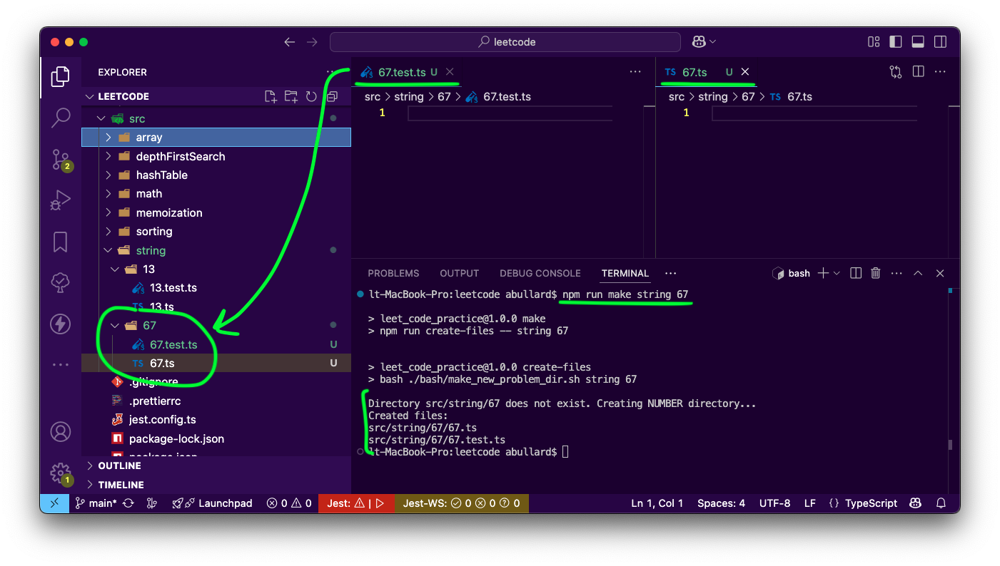
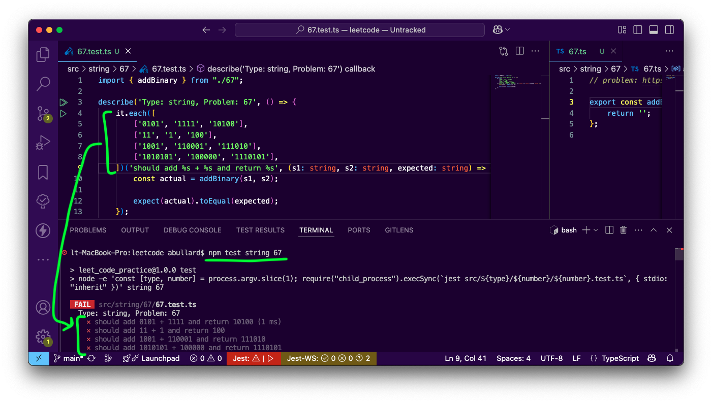
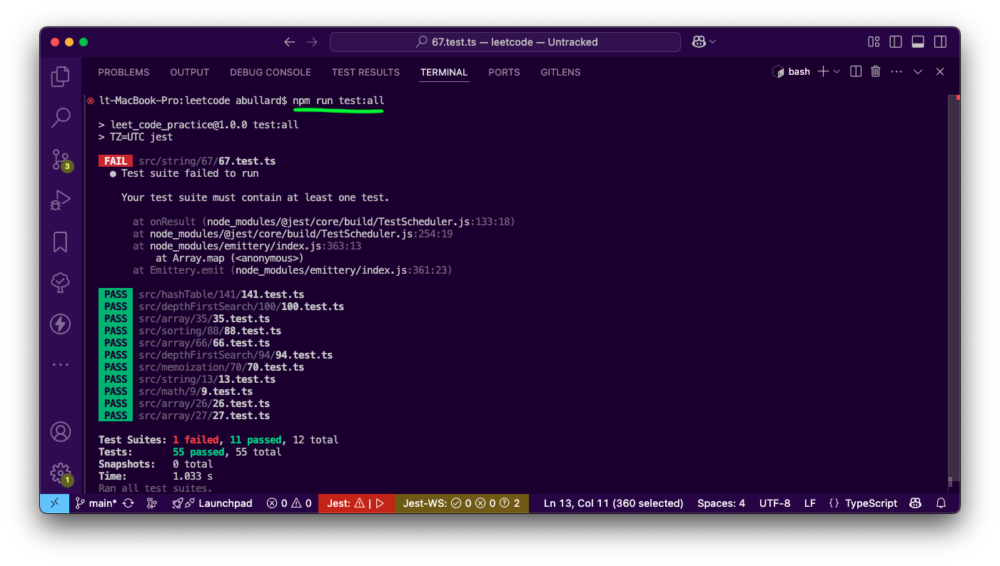
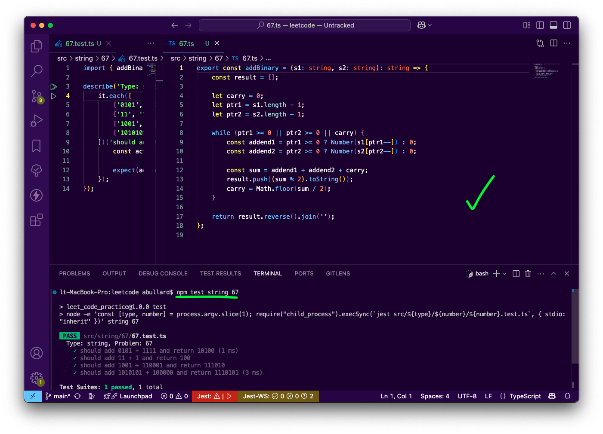

I made a [leetcode repository](https://github.com/abullard/leetcode) to publicly share your skills/effort & to scaffold the creation of a playground for these problems. 

Let's see it in action!

*Note: I'll follow a pseudo-Test Driven Development approach via red/green/refactor in this post.*

### 🏛️ Scaffolding
I'll use [String #67 - Add Binary](https://leetcode.com/problems/add-binary/description/?envType=problem-list-v2&envId=string) as my example problem.
Once *you've* selected a problem to solve, run this command in your terminal–replacing "string" and "67" with your problem specifics:
###### 💾 Code
```bash
npm run make string 67
```

This results in a scaffolded pair of files:
- `<root>/src/string/67/67.ts`
- `<root>/src/string/67/67.test.ts`. 


Likewise:
###### 💾 Code
```bash
npm run make dynamicProgramming 70
```

will create 
- `<root>/src/dynamicProgramming/70/70.ts`
- `<root>/src/dynamicProgramming/70/70.test.ts`. 

Let's get a couple tests written and see them fail...

### 🔴 Red
I wrote a test with 4 cases. It follows a semi-arrange, act, assert pattern. There aren't many cases here, but notice–you can append leetcode test case input with ease here.

#### 💻 Execution
We can run our solution:
###### 💾 code
```bash
npm test array 67
```


Or, if we want to run all the tests
###### 💾 code
```bash
npm run test:all
```


### 🟢 Green
Now make the tests pass! I'll fill mine out to showcase a green cycle.


---

### 🏁 Final Thoughts
I know this is all in TypeScript, but the general idea persists. You could repurpose this repo for any language you wanted. I choose TS because it's familiar for me–I can spin up projects quickly, letting me focus on solutioning over development environment.

That's it! Have fun showcasing your Typescript skills to potential employers. 
